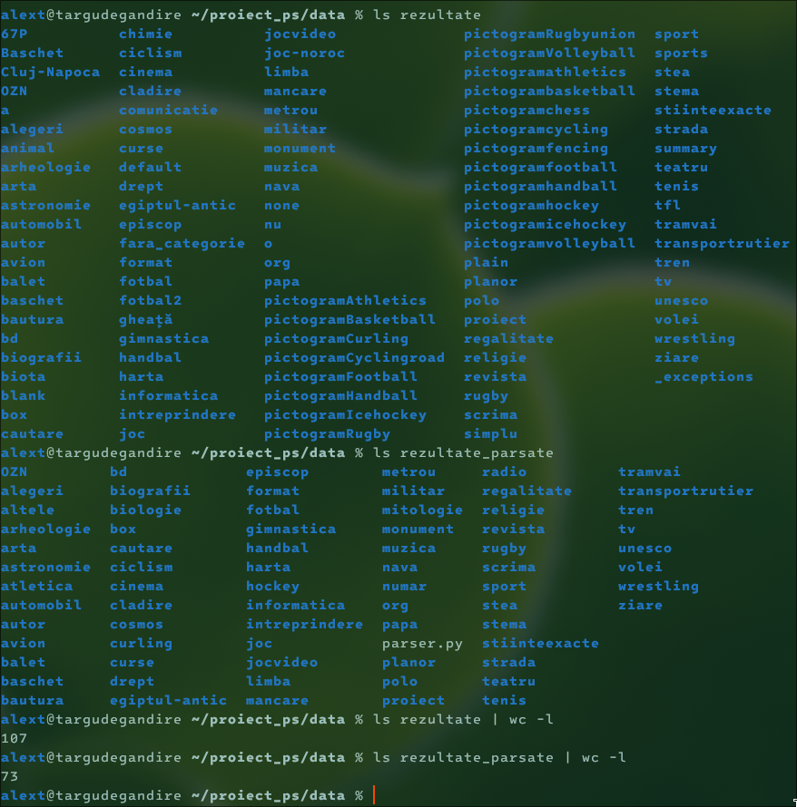

# Procesearea setului de date
Aici am detaliat pașii, precum și problemele prin care am trecut, în procesarea site-ului Wikipedia (în limba română) pentru a fi folosit ulterior în clasificator.
Abordarea mea a fost similară cu cea a unui web-crawler, folosind strict datele din html-urile obținute, fără să folosesc metadatele site-ului[^1]. 
## Obținerea setului de date

Am descărcat[^2] o copie a site-ului Wikipedia în limba română, fără poze, în format .zim (un format open folosit în principal pentru arhivarea site-urilor Wikimedia).  
După aceea, am folosit zimdump[^3] pentru dezarhivarea integrală a copiei, obținând dintr-o arhivă de 2,3 GB un folder cu dimensiunea de peste 17 GB, cu peste 1 milion de fișiere/articole, toate sub același folder, pe care îl vom denumi "*data*" (dura zeci de secunde să dau ls pe folder). 

## Sortarea

Acesta a fost pe departe cel mai greu pas din acest proiect.
Majoritatea sortării a fost făcută folosind sorter.py, care muta articolele într-un folder cu denumirea primului element cu clasa "antet ***categorie***" (care de obicei se află în primul element cu clasa "infocaseta", adică primul tabel informativ care apare în pagină), categoria fiind ultima clasă, adică ***categorie***. Pentru extragerea elementelor HTML, am folosit librăria lxml.

Articolele care nu aveau acest element (care au fost plasate într-un folder numit "fara_categorie"),

De asemenea, redirecturile (care au fost peste 500.000 la număr) au fost plasate folder-ul "redirects". Criteriul pentru ca un articol să fi fost redirect era tag-ul <meta http-equiv='refresh' ...>. 
Am realizat abia în timp ce scriam documentația că acest pas putea fi evitat dacă foloseam din start opțiunea --redirect în zimdump, care mi-ar fi transformat toate redirecturile în symlinkuri, care puteau fi șterse imediat cu o comandă find.

Scriptul sorter.py lua numai fișierele simple, și nu se uita recursiv în foldere. Ca și consecință a acestui comportament, după un run al scriptului, în "*data*" se aflau folderele pentru fiecare categorie, dar și alte foldere ce conțineau un singur articol (comportament folosit UNEORI la dezambiguizare). Aici a apărut scriptul sorter2.py, care pur și simplu scotea articolele din folderele care nu erau categorii (aici folosisem încă un script care considera numai folderele cu cel puțin 5 articole ca fiind categorii dar cumva l-am șters din greșeală :] ). La un moment dat, scriptul se tot oprea, deoarece erau zeci de articole cu exact aceeași denumire, și am sortat manual acele cazuri, până când am rămas doar cu 700 de foldere cu articole nesortate (pe care le-am lăsat așa deoarece era în jur de ora 3 dimineața și obosisem).
Probabil aș fi salvat câteva ore bune din viața mea dacă m-aș fi chinuit să fac un singur script care să se fi uitat recursiv în foldere și ar fi tratat duplicatele :(

După ce am șters folderul "redirects", care oricum nu conținea niciun articol propriu-zis, am mutat toate foldere cu categorii într-un folder numit "rezultate", iar apoi am început să comasez mai multe categorii, iar cele cu categorii non-sugestive (ex. 67P, a, blank, _exceptions, ...) sau cele "fara_categorie" au fost plasate în folder-ul "altele". Din 107 de foldere, am redus numărul la 72 (adică 71 de categorii + "altele"). 
În această etapă am realizat inconsistența foarte largă a denumirilor pe care editorii le foloseau în "categorii" (adică în tabelele informative). Aici pot să dau foarte multe exemple, precum categoria "Cluj-Napoca", care a fost folosită pentru cartierele orașului omonim, sau categoria "joc", care conținea articolul "Șah", deși exista categoria "pictogramchess" (pe care am inclus-o în "joc").

Așadar, în urma sortării am obținut în total 516.220 de articole, dintre care 158.510 erau în folderul "altele", deci avem numai 357.710 articole cu categorie. Pentru că am ales să nu folosim metadatele site-ului (care conținea zeci de mii de categorii), pe lângă articolele care nu au putut fi categorisite, nici categoriile nu sunt neapărat cele mai precise (nu există categoria "istorie" dar cumva există categoria "egiptul-antic"?). Totuși, pentru scopul acestui proiect sortarea a fost suficientă, obținând un număr mic de categorii cu care putem lucra.

## Parsarea

Codul relevant acestui task este în parser.py.

Pentru fiecare articol, am folosit din nou librăria lxml pentru a obține un arbore al întregului document, din care am extras numai textul din elementele paragraf (
), ele conținând în mare majoritate textul relevant din articole.

Odată obținut textul brut, l-am transformat în lowercase, am șters semnele de referință(e.g. \[2\]), semnele de punctuație, și cuvintele foarte comune (zise și stopwords) preluate de pe un repository[^4] cu mici adăugiri (i.e., e.g., și). Tot ce a mai rămas este să normalizez spațiile dintre cuvinte (să fie exact un spațiu între ele), și să suprascriu articolul original.

În câteva cazuri, parsorul prelua și câteva elemente din cutia de navigare de la finalul paginii (pentru că foloseau și tagul 
 loc să folosească doar <a>), așa că a trebuit să exclud elementele care aveau ca ascendent un element cu clasa "navbox".

Pe laptopul meu (AMD Ryzen 6650U, powersave mode), parsarea a durat aprox. 16 minute și a redus dimensiunea datelor de la 17 GB la 5,8 GB.

Mi s-a părut foarte fascinant că, deși sunt mai multe la număr, articolele categorisite ocupau în total numai 1,5 GB, în timp ce articolele fără categorie consumă de aproape 3 ori mai mult (4,3 GB)! 

## Separarea datelor

Pentru a separa datele de antrenament de cele pentru testarea modelului, am folosit scriptul separator.py, care mută articolele în directoare ascunse cu același nume (the UNIX way, adăugăm un punct la începutul denumirii). Am ales în mod arbitrar ponderea de 90% pentru setul de antrenament, cu restul pentru setul de teste.
[^1]: https://dumps.wikimedia.org/rowiki/20251120/
[^2]: https://en.wikipedia.org/wiki/Wikipedia:Database_download#Other_Wikipedia_editions
[^3]: https://github.com/openzim/zim-tools
[^4]: https://github.com/stopwords-iso/stopwords-ro
